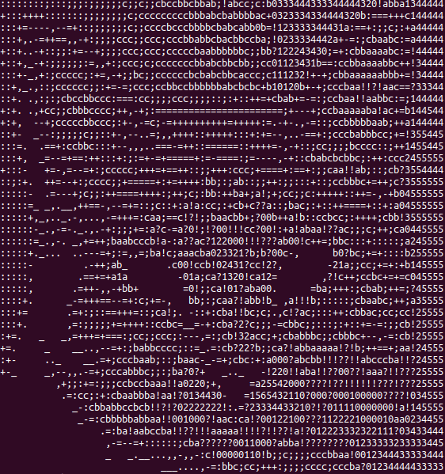

# image-video-to-ascii

C++ project for converting images, videos and camera stream to ascii code using third party libreries as [stblib](https://github.com/nothings/stb) and [opencv](https://github.com/opencv/opencv).

# Image to Ascii
Converting image to ascii using [stblib](https://github.com/nothings/stb) to process images.

 

### Example :

    ./ascii -f ./resources/test.png

# Video/Camera to Ascii
Coverting videos and camera stream to ascii using [opencv](https://github.com/opencv/opencv) library.

### libraries required:
* ### [opencv](https://github.com/opencv/opencv) :
    * ubuntu :
        > sudo apt install libopencv-dev
    * Follow [opencv installation](https://docs.opencv.org/4.x/df/d65/tutorial_table_of_content_introduction.html) for other OS.

### Example :
* Normal usage open camera:

   > **./video_to_ascii**

* using arguments:

    * **video path:**
        > **./video_to_ascii -f ./resources/video.mp4**
    * **set width (height set automatically):**
        > **./video_to_ascii -f ./resources/video.mp4 -width 150**
    * **set width and height:**
        > **./video_to_ascii -f ./resources/video.mp4 -width 500 -height 150**
